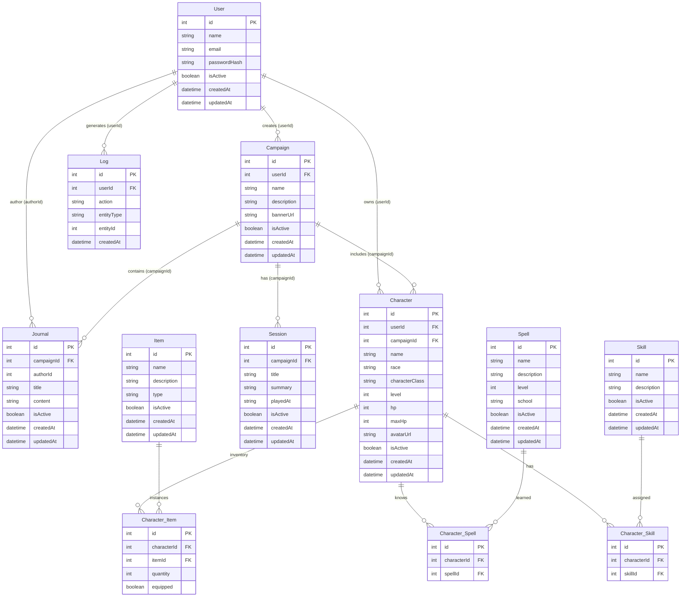

# MER Diagram — RPG Manager

Source: `diagrama_MER_rpgmanager.drawio`

Entity-relationship model for the RPG Manager backend: users, campaigns, characters, and inventory (items, spells, and skills).

---

## Overview (ER)

---

## Entities

### User

| Key | Field | Type |
| --- | --- | --- |
| PK | id | int |
| | name | string |
| | email | string |
| | passwordHash | string |
| | isActive | boolean |
| | createdAt | datetime |
| | updatedAt | datetime |

### Log

| Key | Field | Type |
| --- | --- | --- |
| PK | id | int |
| FK | userId | int |
| | action | string |
| | entityType | string |
| | entityId | int |
| | createdAt | datetime |

### Campaign

| Key | Field | Type |
| --- | --- | --- |
| PK | id | int |
| FK | userId | int |
| | name | string |
| | description | string |
| | bannerUrl | string |
| | isActive | boolean |
| | createdAt | datetime |
| | updatedAt | datetime |

### Session

| Key | Field | Type |
| --- | --- | --- |
| PK | id | int |
| FK | campaignId | int |
| | title | string |
| | summary | string |
| | playedAt | string |
| | isActive | boolean |
| | createdAt | datetime |
| | updatedAt | datetime |

### Journal

| Key | Field | Type |
| --- | --- | --- |
| PK | id | int |
| FK | campaignId | int |
| | authorId | int |
| | title | string |
| | content | string |
| | isActive | boolean |
| | createdAt | datetime |
| | updatedAt | datetime |

> In the Draw.io file, `authorId` is not marked as FK on the box, but there is an edge linking `User` → `Journal`.

### Character

| Key | Field | Type |
| --- | --- | --- |
| PK | id | int |
| FK | userId | int |
| FK | campaignId | int |
| | name | string |
| | race | string |
| | characterClass | string |
| | level | int |
| | hp | int |
| | maxHp | int |
| | avatarUrl | string |
| | isActive | boolean |
| | createdAt | datetime |
| | updatedAt | datetime |

### Item

| Key | Field | Type |
| --- | --- | --- |
| PK | id | int |
| | name | string |
| | description | string |
| | type | string |
| | isActive | boolean |
| | createdAt | datetime |
| | updatedAt | datetime |

### Character_Item

Inventory table (N:N between `Character` and `Item`).

| Key | Field | Type |
| --- | --- | --- |
| PK | id | int |
| FK | characterId | int |
| FK | itemId | int |
| | quantity | int |
| | equipped | boolean |

### Spell

| Key | Field | Type |
| --- | --- | --- |
| PK | id | int |
| | name | string |
| | description | string |
| | level | int |
| | school | string |
| | isActive | boolean |
| | createdAt | datetime |
| | updatedAt | datetime |

### Character_Spell

Association table (N:N between `Character` and `Spell`).

| Key | Field | Type |
| --- | --- | --- |
| PK | id | int |
| FK | characterId | int |
| FK | spellId | int |

### Skill

| Key | Field | Type |
| --- | --- | --- |
| PK | id | int |
| | name | string |
| | description | string |
| | isActive | boolean |
| | createdAt | datetime |
| | updatedAt | datetime |

### Character_Skill

Association table (N:N between `Character` and `Skill`).

| Key | Field | Type |
| --- | --- | --- |
| PK | id | int |
| FK | characterId | int |
| FK | skillId | int |

---

## Relationships

| From | To | Cardinality | Via |
| --- | --- | --- | --- |
| User | Campaign | 1:N | `Campaign.userId` |
| User | Log | 1:N | `Log.userId` |
| User | Journal | 1:N | `Journal.authorId` |
| User | Character | 1:N | `Character.userId` |
| Campaign | Session | 1:N | `Session.campaignId` |
| Campaign | Journal | 1:N | `Journal.campaignId` |
| Campaign | Character | 1:N | `Character.campaignId` |
| Character | Character_Item | 1:N | `Character_Item.characterId` |
| Item | Character_Item | 1:N | `Character_Item.itemId` |
| Character | Character_Spell | 1:N | `Character_Spell.characterId` |
| Spell | Character_Spell | 1:N | `Character_Spell.spellId` |
| Character | Character_Skill | 1:N | `Character_Skill.characterId` |
| Skill | Character_Skill | 1:N | `Character_Skill.skillId` |

---

## Model domains

1. **Account and auditing** — `User`, `Log`
2. **Campaign** — `Campaign`, `Session`, `Journal`
3. **Character** — `Character`
4. **Inventory and abilities** — `Item` / `Character_Item`, `Spell` / `Character_Spell`, `Skill` / `Character_Skill`
