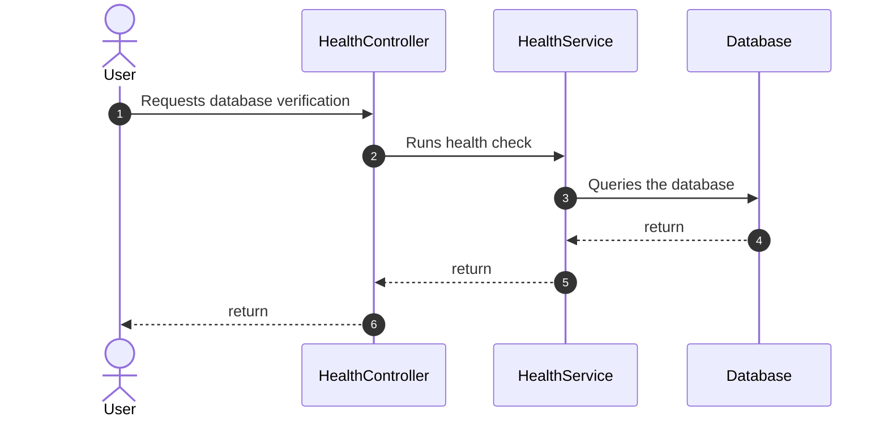
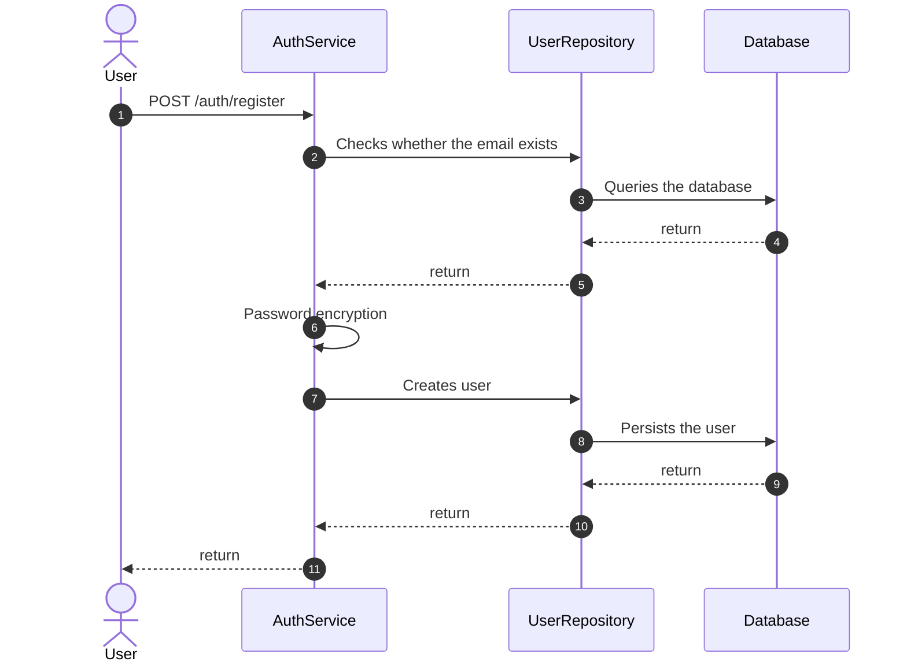

# Sequence Diagram — RPG Manager

Source: `diagrama_sequencia_rpgmanager.drawio`

Two main authentication/infrastructure flows.

---

## 1. Database stability check

Verifies whether the database is healthy before continuing with system operations.

### Participants

| Participant | Role |
| --- | --- |
| User | Actor who requests the check |
| HealthController | Boundary / health API |
| HealthService | Control / health-check logic |
| Database | Entity / database |

### Steps

1. The user requests a database check.
2. `HealthController` triggers the health check on `HealthService`.
3. `HealthService` queries the database.
4. The result returns through the chain back to the user.

---

## 2. User registration

Registration flow via `POST /auth/register`.

### Participants

| Participant | Role |
| --- | --- |
| User | Actor who registers |
| AuthService | Boundary / authentication service |
| UserRepository | Control / user data access |
| Database | Entity / database |

### Steps

1. The user sends `POST /auth/register`.
2. `AuthService` asks `UserRepository` to check whether the email already exists.
3. The repository queries the database and returns the result.
4. `AuthService` encrypts the password (self-call).
5. `AuthService` requests user creation.
6. The repository persists the user in the database and the result returns to the user.

### Legend (Draw.io UML notation)

| Symbol | Meaning |
| --- | --- |
| Solid / filled arrow | Synchronous message |
| Open arrow | Asynchronous message |
| Dashed arrow | Return |
